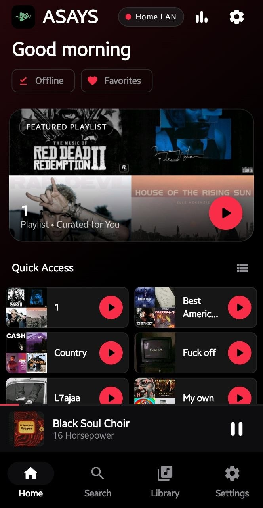
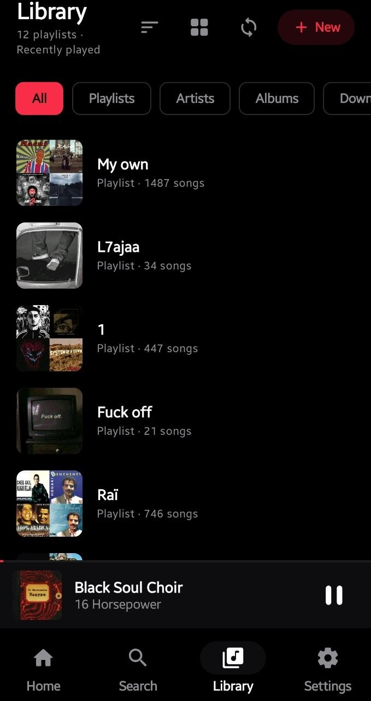
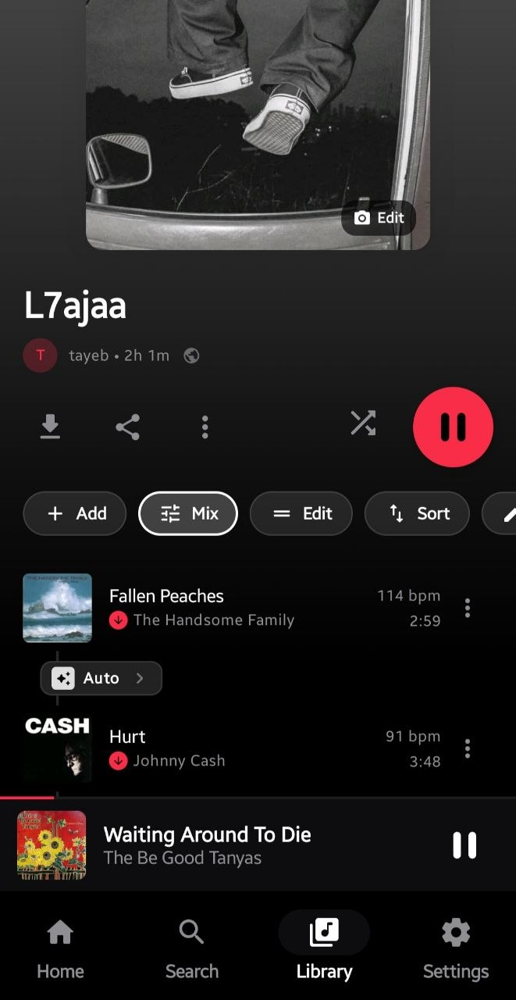
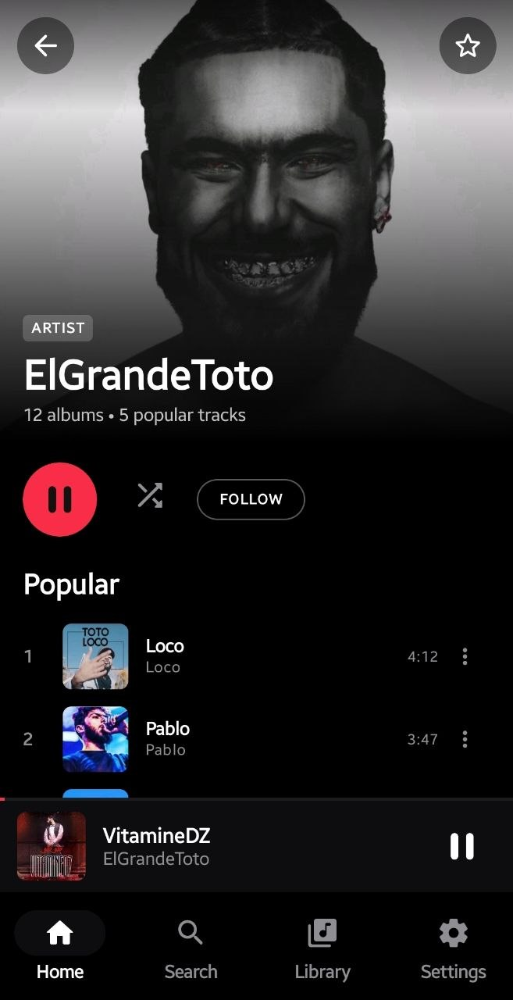
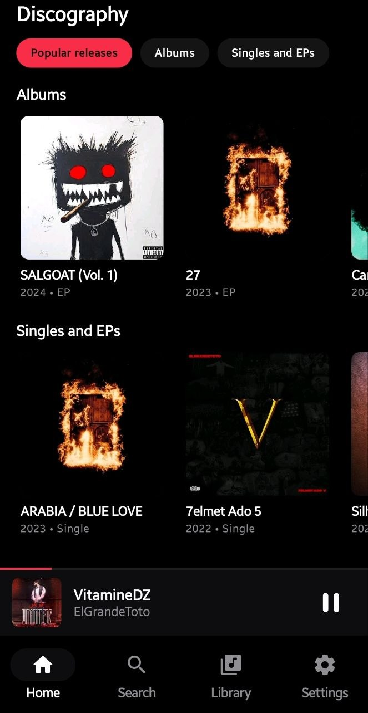
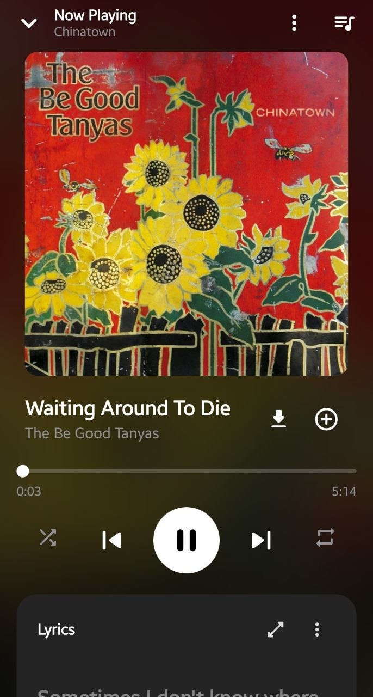
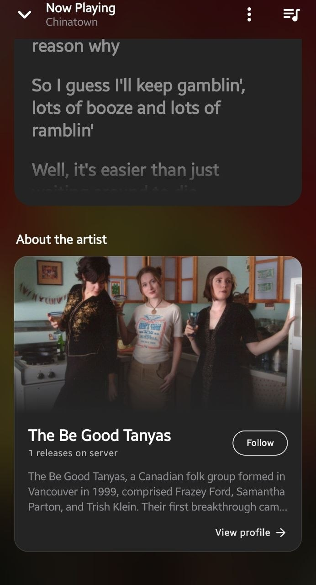
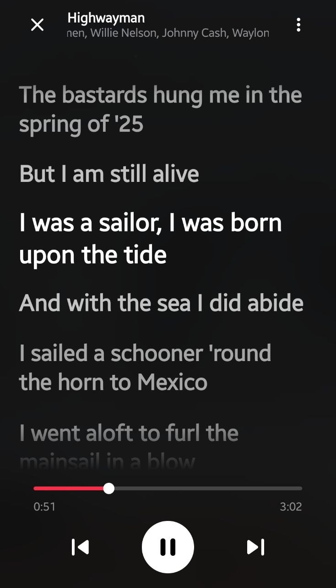
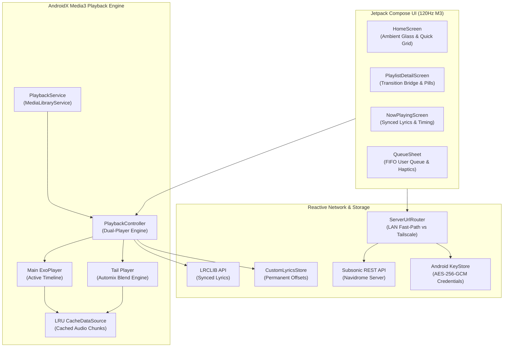

# <p align="center"> <br><b>Asays</b></p>

<p align="center">
  <b>A Hyper-Refined, Spotify-Grade Android Music Client for Self-Hosted Navidrome & Subsonic Servers.</b>
</p>

<p align="center">
  
  
  
  
  
  
  
</p>

> [!NOTE]
> **🚧 Active Development & Frequent Updates**  
> **Asays** is actively being developed and polished. The app is in continuous evolution — new features, performance enhancements, and bug fixes are rolling out on a regular basis.

---

## 📸 Screenshots Showcase

<table align="center">
  <tr>
    <td align="center" width="25%">
      <b>Home & Quick Access</b><br><br>
      
    </td>
    <td align="center" width="25%">
      <b>Library & Playlists</b><br><br>
      
    </td>
    <td align="center" width="25%">
      <b>Playlist Detail & DJ Mix</b><br><br>
      
    </td>
    <td align="center" width="25%">
      <b>Artist Profile</b><br><br>
      
    </td>
  </tr>
  <tr>
    <td align="center" width="25%">
      <b>Full Discography</b><br><br>
      
    </td>
    <td align="center" width="25%">
      <b>Now Playing Player</b><br><br>
      
    </td>
    <td align="center" width="25%">
      <b>Synced Lyrics & Queue</b><br><br>
      
    </td>
    <td align="center" width="25%">
      <b>Fullscreen Synced Lyrics</b><br><br>
      
    </td>
  </tr>
</table>

---

## 🌟 Key Highlights & Engineering Features

### 🎛️ 1. BitChord-Style Automix & DJ Transitions
- **Dual-Player ExoPlayer Engine**: Seamlessly overlaps consecutive tracks without restarting the media pipeline or suffering Android audio-focus drops. The outgoing track tail plays from local cache while the incoming track starts smoothly.
- **5 Transition Curves**:
  - **Equal-Power Cosine / Sine** ($\cos^2(t) + \sin^2(t) = 1$): Professional broadcast standard preserving continuous acoustic energy.
  - **Quadratic Melt**: Smooth exponential dip and resurgence for ambient transitions.
  - **Exponential Rise**: High-energy dance and hip-hop build-ups.
  - **Zero-Gap Slam**: Hard cut with zero millisecond latency or silence gap.
  - **Standard Crossfade**: Linear audio blend.
- **Dynamic Bridge Sheet**: Per-transition duration (2s–12s) and curve overrides, with immediate preview and optional playlist-wide application.

### 🔀 2. Spotify-Grade Smart Shuffle & FIFO Queue
- **Non-Destructive In-Place Reordering**: Toggling shuffle during playback dynamically updates upcoming items using `removeMediaItems` / `addMediaItems` without timeline reconstruction (`setMediaItems`), eliminating audio buffering stutters.
- **FIFO User Queue Priority (`isUserQueued`)**: Tracks queued manually are inserted immediately after the active song in FIFO order (`NEXT IN QUEUE`), neatly separated from context albums/playlists (`NEXT FROM ALBUM`).
- **Continuous Fluid Drag-and-Drop**: Gesture-resilient item reordering in `QueueSheet` backed by stable `QueueEntry` IDs and haptic tactile feedback.

### 🎤 3. Real-Time Synced Lyrics & Calibration
- **LRCLIB Integration**: Instant synchronized line-by-line lyrics matching with duration validation ($\pm 6\text{s}$).
- **Millisecond Timing Calibration**: Integrated timing slider allowing $-5000\text{ms}$ to $+5000\text{ms}$ live offset adjustments.
- **Cache-Resilient Storage (`CustomLyricsStore`)**: Calibrations and custom lyrics are persisted in isolated app storage—immune to cache cleanups.
- **Navidrome Companion Export**: 1-tap `.lrc` generator matching standard `[mm:ss.xx]` tags for easy synchronization with your server library.

### 🚗 4. Android Auto Coolwalk Integration
- **Native `MediaLibraryService` Architecture**: Deep system integration with vehicle infotainment displays.
- **Sandboxed Car Artwork**: Custom `ArtworkContentProvider` serving vehicle displays (`content://com.naviify.app.artwork/...`) without file-URI permission blocks.
- **Dedicated Car Action Controls**: Favorite toggles, shuffle controls, and playlist browsing optimized for safe driving.

### ⚡ 5. 120Hz Hyper-Smooth UI Architecture
- **Zero UI-Thread Disk I/O**: In-memory $O(1)$ hash map lookup (`coverFileIndex`) replaces synchronous flash storage queries during scroll passes.
- **Coil Hardware Bitmaps (RGB_565)**: Reduces memory overhead by 50% without visible degradation on mobile AMOLED screens.
- **Zero-Allocation Geometry**: Replaced per-frame cubic bezier and `Path()` allocations with GPU primitive draw commands.
- **Stale-While-Revalidate Caching**: Instantaneous 0ms cold-start and seamless tab switching.

### 🌐 6. Dual-Network Reactive Failover
- **LAN vs Tailscale Fast-Path**: Probes local Wi-Fi fast-path (<350ms) and seamlessly switches to secure Tailscale VPN IP when leaving home.
- **Android KeyStore AES-256-GCM**: Hardware-backed cryptographic protection for server passwords and API tokens.
- **Navidrome / OpenSubsonic REST API**: Full support for salt + token MD5 authentication, scrobbling, and remote playlist manipulation.

### 🤖 7. Home Server & Hermes AI Integration
- **Direct Bare Git Sync**: Built-in synchronization with local server bare git repositories (`/srv/git/naviify.git`).
- **Remote Vibe Coding**: Seamless collaboration with home server agent via Telegram and `vibe.sh`, enabling remote features development from anywhere.

---

## 🏗️ Architectural Overview



---

## 🛠️ Technology Stack

| Layer | Technology | Purpose |
|---|---|---|
| **Language** | Kotlin 2.0+ | Coroutines, StateFlow, Flow operators |
| **UI Framework** | Jetpack Compose + Material 3 | Modern declarative reactive UI |
| **Audio Core** | AndroidX Media3 (1.5+) | `ExoPlayer`, `MediaSession`, `MediaLibraryService` |
| **Car Integration** | Android Auto Coolwalk | Infotainment browse tree & custom media controls |
| **Image Pipeline** | Coil 2 | Hardware bitmaps (RGB_565), static salt caching |
| **Networking** | Retrofit 2 + OkHttp 4 | Subsonic / OpenSubsonic REST API with retry interceptors |
| **Dependency Injection** | Dagger Hilt | Modular decoupled component injection |
| **Security** | Android KeyStore + DataStore | AES-256-GCM hardware encryption for server secrets |
| **Lyrics** | LRCLIB Client | Dynamic timestamped LRC parsing and synchronization |

---

## 📂 Project Structure

```
app/src/main/java/com/naviify/app/
├── core/
│   ├── image/             # Coil module, hardware bitmap loader, static salt caching
│   ├── network/           # Subsonic API service, token generators, LAN/Tailscale router
│   ├── playback/          # Media3 service, Dual-Player automix engine, Auto callbacks
│   ├── storage/           # Android KeyStore AES-256 encryption, DataStore preferences
│   └── theme/             # 10 preset themes, dynamic ambient palette extraction
├── data/
│   ├── download/          # Semaphore-controlled downloads, offline playlist persistence
│   ├── lyrics/            # LRCLIB API client, CustomLyricsStore permanent calibration
│   ├── repository/        # Media repository, favorites, albums, artists, search
│   └── stats/             # Listening history, streaks, and play statistics
├── domain/
│   ├── model/             # Immutable data models (Track, Album, Playlist, SyncedLine)
│   └── playback/          # PlayerQueueStore, Smart Shuffle state, FIFO insertions
└── ui/
    ├── components/        # Ambient backdrop, TrackRow, MarqueeText, ActionSheets
    ├── home/              # 6-grid quick access, user playlist carousels
    ├── player/            # Fullscreen now playing, synced lyrics sheet, interactive queue
    └── playlist/          # Playlist detail, sorting sheets, DJ Transition Bridge
```

---

## 🚀 Building & Installation

### Prerequisites
- **JDK**: Version 17 or higher
- **Android SDK**: Build Tools `34.0.0+`, Compile SDK `34`
- **Gradle**: 8.7+ (Wrapper included)
- **Subsonic Server**: [Navidrome](https://www.navidrome.org/) v0.50+ or compatible Subsonic server

### Build Commands

```bash
# 1. Clone the repository
git clone https://github.com/hamzaelkachtaf4-star/asays.git
cd asays

# 2. Run the complete Unit Test suite (94 tests)
./gradlew testDebugUnitTest

# 3. Compile and assemble debug APK
./gradlew assembleDebug

# 4. Install directly to a connected USB Android device (ADB)
adb install -r app/build/outputs/apk/debug/app-debug.apk
```

---

## 🔒 Security & Privacy

- **100% Self-Hosted**: All music, metadata, and playlist data stream directly from your own private Navidrome / Subsonic server.
- **Air-Gapped Credentials**: Passwords and authentication tokens are encrypted using **AES-256-GCM** inside the Android Hardware Security Module (Keystore).
- **No Third-Party Analytics**: Zero telemetry, tracking, or external advertising SDKs.

---

## 📄 License & Attribution

- Built with ❤️ for self-hosted audio enthusiasts.
- Incorporates concepts and inspirations from **Spotify Mobile**, **BitChord Automix Engine**, and the **OpenSubsonic** community.
